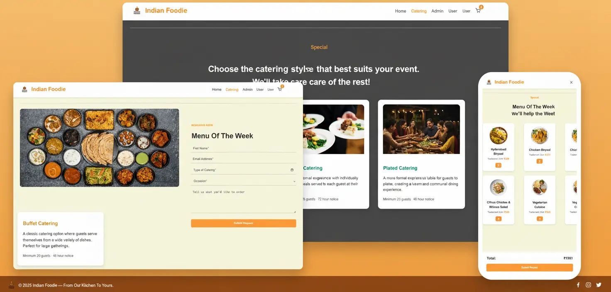

🧾 README.md

# 🍽️ Catering & Ordering Website (LocalStorage Version)

This is a **modern catering and food ordering web app** built with **HTML, CSS, and JavaScript** — fully client-side, using **LocalStorage** for data persistence (no Firebase or server required).

The project supports **Admin and User** roles with separate dashboards, dynamic order management, and elegant UI styled in **Saffron (Indian orange)** tones.

---

## 🌐 Live Demo

👉 **[View the Website](https://raidanrei.github.io/Catering-Order-Website/)**  
Experience the interactive slider in action!

---

## 📸 Preview

| Screenshot |
| ---------- |



---

## ✨ Features

### 👑 Admin Panel

- Login/Register using default localStorage admin credentials.
- Add new products (name, price, description, image URL).
- View all existing products in a responsive grid layout.
- View and manage user orders.
- Update order status (`Submitted → Approved → Completed`).
- Delete products or orders directly from dashboard.

### 🙋‍♂️ User Panel

- Login/Register using localStorage user account.
- Browse and place orders for available menu items.
- View order history.
- Logout functionality included on all main pages (`index.html`, `catering.html`, `user.html`).

### 🛒 Cart System

- Fully dynamic cart sidebar with add/remove functionality.
- Real-time total price calculation.
- Checkout simulation.

### 🎨 UI & Design

- Responsive saffron-themed layout.
- Animated hover effects for buttons and pricing.
- Centered, elegant **place order form** with glowing animation.
- Consistent navbar and footer styling across all pages.

---

## 🗂️ Project Structure

```bash
📦 project/
│
├── index.html # Landing page with menu, hero, and features
├── catering.html # Catering service form & information
├── user.html # User login/register + order management
├── admin.html # Admin login/register + product management
│
├── style.css # Main stylesheet (Saffron theme, responsive)
├── admin.js # Admin logic: auth, products, order control
├── user.js # User logic: auth, order placement, localStorage
├── cart.js # Cart handling and sidebar management
├── catering.js # Catering form and UI interactions
│
└── (Optional) firebase.js # Not required — replaced by LocalStorage
```

---

## ⚙️ LocalStorage Structure

| Key                              | Description                                  |
| -------------------------------- | -------------------------------------------- |
| `admins`                         | List of admin accounts (email/password).     |
| `users`                          | List of user accounts.                       |
| `products`                       | All added menu items by admin.               |
| `orders`                         | All submitted orders (shared by both roles). |
| `cart`                           | Temporary shopping cart for user.            |
| `loggedInAdmin` / `loggedInUser` | Tracks active session.                       |

---

## 🧩 Default Accounts

```js
// Admin (for first-time login)
Email: admin@catering.com
Password: admin123

// User (default demo)
Email: user@demo.com
Password: user123
```

---

## 🧠 How It Works

1. When you first load the site, it automatically seeds default data into LocalStorage.

2. Admin can log in → manage menu & orders.

3. User can log in → browse menu & place orders.

4. Data updates in real-time through LocalStorage — no external backend needed.

---

## 🎨 Theme & Colors

| Element    | Color                 | Description                               |
| ---------- | --------------------- | ----------------------------------------- |
| Primary    | `#FF9933`             | Saffron orange for buttons and highlights |
| Hover      | `#CC7A00` / `#E63900` | Dark saffron & crimson for interaction    |
| Background | `#F5F5DC`             | Warm beige background                     |
| Text       | `#333333`             | Neutral dark gray for readability         |

---

## 📱 Responsiveness

- The layout is fully responsive:

- Grid-based menu and product listing.

- Flexible catering form layout.

- Collapsible cart sidebar on smaller screens.

---

## 🚀 Getting Started

1️⃣ Clone or Download

```bash
   git clone https://github.com/yourusername/catering-localstorage.git
```

2️⃣ Run locally:

```bash
open index.html
```

---

## 💡 Developer Notes

- The project is offline-first and works without internet.

- You can safely remove firebase.js — it’s not used in this version.

- To reset data, clear your browser’s LocalStorage.

---

## 👨‍💻 Author

GitHub Profile 🔗 [RaidanRei](https://github.com/RaidanRei)

If you like this project, feel free to ⭐ star the repository!

---
